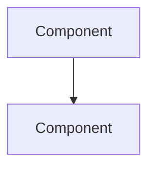

# Architecture

Last updated: {{DATE}}

## Overview

Fewer than four paragraphs: the current whole-system view — what exists today, not
the plan for what's next.

## System Design

Box diagram — components + arrows labeled with what crosses them. `/diagram` is
reachable by hand for a polished export (swimlanes, DFD trust boundaries); this
fence is the default because it stays greppable and renders natively on GitHub with
no extra artifact to keep in sync.

## Components

Per component: responsibility, concrete file/module, which `FR-NN`/`NFR-NN`(s) it
satisfies.

- **`<component>`** (`<path>`) — responsibility. Satisfies: FR-NN, NFR-NN.

## Interfaces

Contracts between components — **and** external boundaries (third-party APIs,
services outside your control). External interfaces are where architecture actually
rots; list them explicitly, not folded into Components prose.

## Data & State

What persists, what's in-memory, where it lives.

## Deployment

Omit for repo-local tooling. Required once the project has a deploy target —
topology, environments, release path.

## Key Decisions

Chosen approach + rejected alternative, only where the tradeoff matters later. Omit
if nothing was actually debated.

## Failure Behavior

How the system fails — silent vs loud, partial failure, recovery. Directly answers
NFR items like "no silent failures."

## Traceability

| FR/NFR | Component     |
| ------ | ------------- |
| FR-NN  | `<component>` |
| NFR-NN | `<component>` |

Bidirectional gate: every `[active]` `FR-NN`/`NFR-NN` in `docs/REQUIREMENTS.md`
appears here, **and** every row here cites a real `FR-NN`/`NFR-NN` — no orphan
components on either side. `[deprecated]` requirements are not required to have a
row.

## Open Technical Questions

Unresolved decisions → routes back to `/grill-me`.
